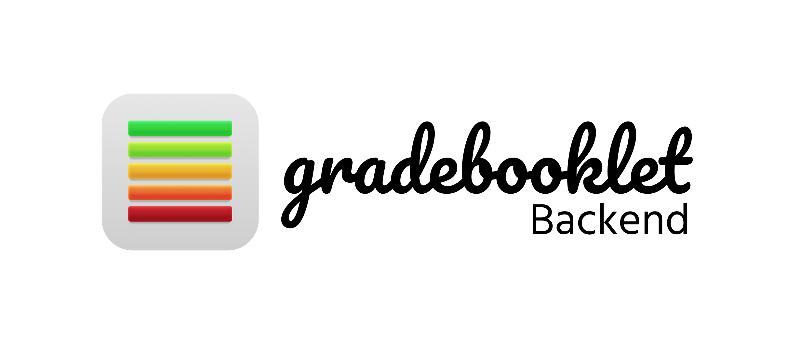

# gradebooklet-backend (under construction at the moment.)



Rails 6 API-Only Backend, made for the gradebooklet mobile application.

## Getting started

Run bundle
```bash
$ bundle install
```

Setup local db
```bash
$ rails db:setup && rails db:migrate
```

Run server
```bash
$ rails s
```